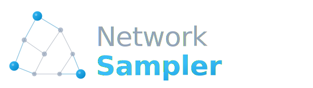

.. image:: https://img.shields.io/pypi/v/networksampler?color=blue
  :target: https://pypi.org/project/networksampler/

.. image:: https://img.shields.io/badge/License-LGPL%20v3-blue
   :target: https://github.com/edgresearch/pylib_networksampler/blob/master/LICENSE

.. image:: https://img.shields.io/badge/DOI-10.1007/s11634--026--00670--z-green
   :target: https://doi.org/10.1007/s11634-026-00670-z

.. image:: https://img.shields.io/badge/GitHub-edgresearch/pylib__networksampler-181717?logo=github
   :target: https://github.com/edgresearch/pylib_networksampler
   :alt: GitHub

NetworkSampler: smart networks sampling
=======================================================

The library purpose
-------------------

NetworkSampler is a Python package for sampling network nodes using space-filling designs.
It works by *minimizing* the geodesic distance of the sample in the network,
and *maximizing* the coverage over the graph.

This package is particularly helpful with semi-supervised machine learning approaches:
with this package you can select a sample of nodes to be manually labeled, to extend
the classification all over the network via label propagation. The space-filling sampling
strategy ensures that the selected seed nodes are well distributed across the network,
leading to more accurate and reliable predictions compared to traditional sampling methods.

For more details check the publication:

    del Gobbo E., Fontanella L., Ippoliti L., Di Zio S., Fontanella S., Cucco A. (2026).
    *A space-filling sampling approach for collective classification of social media data*.
    Advances in Data Analysis and Classification.
    `https://doi.org/10.1007/s11634-026-00670-z <https://doi.org/10.1007/s11634-026-00670-z>`_

- **Website (including documentation):** https://edgresearch.github.io/pylib_networksampler
- **Source:** https://github.com/edgresearch/pylib_networksampler
- **Bug reports:** https://github.com/edgresearch/pylib_networksampler/issues
- **Pip Package:** https://pypi.org/project/networksampler

Tutorials
--------------

A comprehensive tutorial is available in the [official documentation](https://edgresearch.github.io/pylib_networksampler/tutorial.html).

If you prefer a hands-on approach, you can find a complete Jupyter Notebook illustrating the library's features step-by-step directly in the repository. You can open and run it directly in your browser using Google Colab:

.. image:: https://colab.research.google.com/assets/colab-badge.svg
   :target: https://colab.research.google.com/github/edgresearch/pylib_networksampler/blob/master/notebooks/basic_tutorial.ipynb
   :alt: Open In Colab

* Or view the source file here: `notebooks/basic_tutorial.ipynb <https://github.com/edgresearch/pylib_networksampler/blob/master/notebooks/basic_tutorial.ipynb>`_

Simple example
--------------

Extract a sample that maximizes the coverage of a network:

.. code-block:: python

    import networksampler
    import networkx as nx

    # Generate an adjacency matrix of 1000 nodes full connected
    G = nx.gaussian_random_partition_graph(1000, 500, 100, 0.20, 0.1)
    A = nx.adjacency_matrix(G).todense()

    # Extract the sample:
    # nodes number = 10
    # p = -4 and q = 4
    # r = 0.1
    networksampler.sa_sampling(A, 10, -4, 4, 0.1)
    (array([ 14,  135, 213, 256, 345, 560, 678, 690, 900, 967]),
     7.727146854012883)

Install
-------

Install the latest version of NetworkSampler::

    $ pip install networksampler

Bugs
----

Please report any bugs that you find `here <https://github.com/edgresearch/pylib_networksampler/issues>`_.
Or, even better, fork the repository on `GitHub <https://github.com/edgresearch/pylib_networksampler>`_
and create a pull request (PR). We welcome all changes, big or small, to improve the library performance.

How to cite this package in publications?
-----------------------------------------

If you use this package in your research, please cite the following paper::

    del Gobbo E., Fontanella L., Ippoliti L., Di Zio S., Fontanella S., Cucco A. (2026).
    A space-filling sampling approach for collective classification of social media data.
    Advances in Data Analysis and Classification.
    https://doi.org/10.1007/s11634-026-00670-z

BibTeX::

    @article{delgobbo2026spacefilling,
      author  = {del Gobbo, Emiliano and Fontanella, Lara and Ippoliti, Luigi and Di Zio, Simone and Fontanella, Sara and Cucco, Alex},
      title   = {A space-filling sampling approach for collective classification of social media data},
      journal = {Advances in Data Analysis and Classification},
      year    = {2026},
      doi     = {10.1007/s11634-026-00670-z},
      url     = {https://doi.org/10.1007/s11634-026-00670-z}
    }

RIS::

    TY  - JOUR
    AU  - del Gobbo, Emiliano
    AU  - Fontanella, Lara
    AU  - Ippoliti, Luigi
    AU  - Di Zio, Simone
    AU  - Fontanella, Sara
    AU  - Cucco, Alex
    PY  - 2026
    TI  - A space-filling sampling approach for collective classification of social media data
    T2  - Advances in Data Analysis and Classification
    DO  - 10.1007/s11634-026-00670-z
    UR  - https://doi.org/10.1007/s11634-026-00670-z
    ER  -

License
-------

The library is released under the GNU LESSER GENERAL PUBLIC LICENSE v3.

The library logo has Proprietary license and cannot be used for other projects.
If you fork the project, you MUST indicate it is a derivate project and not
use the logo to identify the project.

**Copyright (C) 2021-2026 Emiliano del Gobbo**

*Emiliano del Gobbo* <emidelgo@gmail.com>

Check the :ref:`License Page <license-label>` for details.

.. toctree::
   :hidden:

   self

.. toctree::
    :maxdepth: 1
    :hidden:

    tutorial
    api
    howtocite
    license

Indices and tables
==================
* :ref:`genindex`
* :ref:`modindex`
* :ref:`search`
